# Poor-Mans-Piano
FPGA based MIDI keyboard project for EEE 304 (Digital Electronics Laboratory)

This project was adapted from the following GIT repository:
https://github.com/mdelrosa/cafinalproject


<figure align="center">
    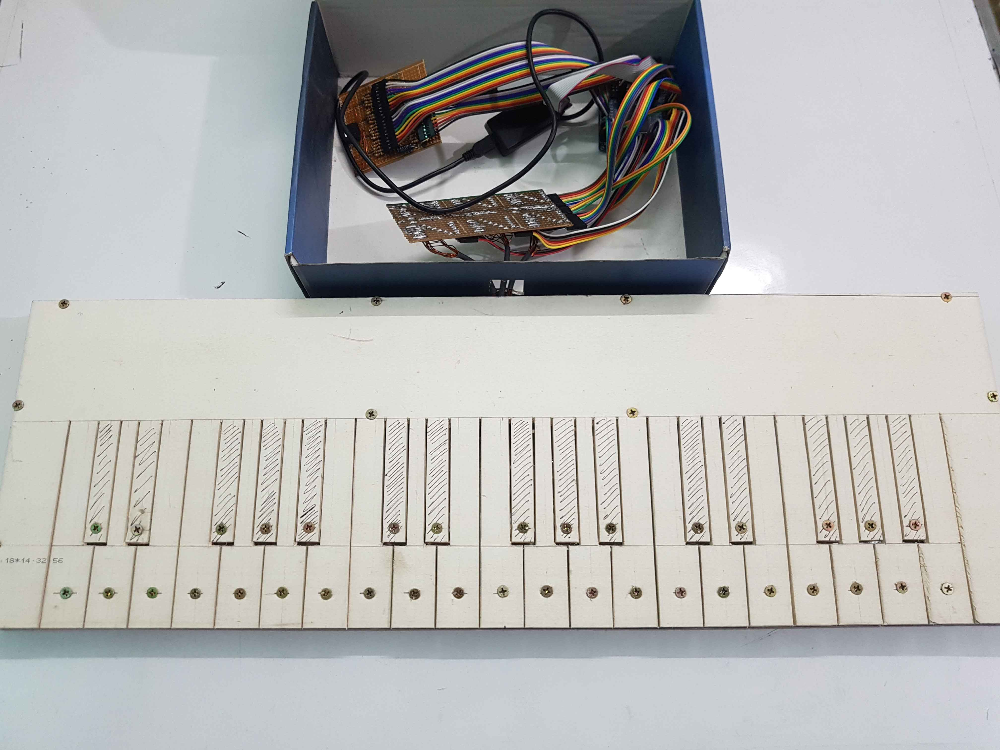
    <figcaption>Poor Man's Piano</figcaption>
</figure>

## Contents
- [Repository Overview](#repository-overview)
- [Materials Used](#materials-used)
- [Useful Links](#useful-links)
- [Working Procedure](#working-procedure)
- [Verilog Simulation](#verilog-simulation)
- [Output Stage Simulation](#output-stage-simulation)
- [Hardware Setup](#hardware-setup)
- [Final Demo](#final-demo)
- [Conclusion](#conclusion)
- [Team](#team)

## Repository Overview
- <a href="https://github.com/ClockWorkKid/Poor-Mans-Piano/tree/main/Piano">Piano</a> is the quartus project folder containing verilog code and simulation files.
- <a href="https://github.com/ClockWorkKid/Poor-Mans-Piano/tree/main/proteus">proteus</a> contains proteus simulation of the output stage.
- <a href="https://github.com/ClockWorkKid/Poor-Mans-Piano/blob/main/proposal.docx">proposal.docx</a> is the project proposal.
- <a href="https://github.com/ClockWorkKid/Poor-Mans-Piano/tree/main/proposal%20files">proposal files</a> contains design materials used for the diagrams.
- <a href="https://github.com/ClockWorkKid/Poor-Mans-Piano/tree/main/screenshots">screenshots</a> folder contains images


## Materials Used

- Altera Cyclone II EP2C5T144 development board (<a href="http://land-boards.com/blwiki/index.php?title=Cyclone_II_EP2C5_Mini_Dev_Board">link</a>)
- Altera USB Blaster V-2 (<a href="https://www.amazon.com/ALTERA-Blaster-ByteBlaster-Download-Debugger/dp/B00UVM2AQ4">link</a>)
- PVC board and cutter (for keyboard body)
- Screws (for key contact + body)
- Female-Female jumpers (A lot!)
- 26 AWG wires (connects screws with circuit board)
- Aluminium foil (positive rail)
- 3.5mm headphone jack female
- Veroboard, soldering tools
- AWEI Y220 speaker with auxiliary cable

## Useful Links

- <a href="https://www.youtube.com/watch?v=xppagENez_Y&ab_channel=MilanKarakas">Coding, compiling and uploading to Cyclone II FPGA board</a>
- <a href="https://www.youtube.com/watch?v=ZrMe8JS7Ktk&ab_channel=LearnElectronicsOnline">Uploading program to Cyclone II FPGA EEPROM </a>

## Working Procedure
There are three main units of the piano - input keyboard, FPGA tone generator and output speaker. 

### Input 

The input keyboard consists of 36 keys housing 3 octaves starting with the C3 note up to B5 note. Keys have screws connected to them, and a wire connected to the screws go to a single circuit board where they are pulled down with a 10k resistor. The base of the keyboard is made of aluminium foil and connected to positive terminal of the FPGA board. When a key touches the foil layer, the screw gets a high voltage that is sensed by input pins of the FPGA board.

<figure align="center">
    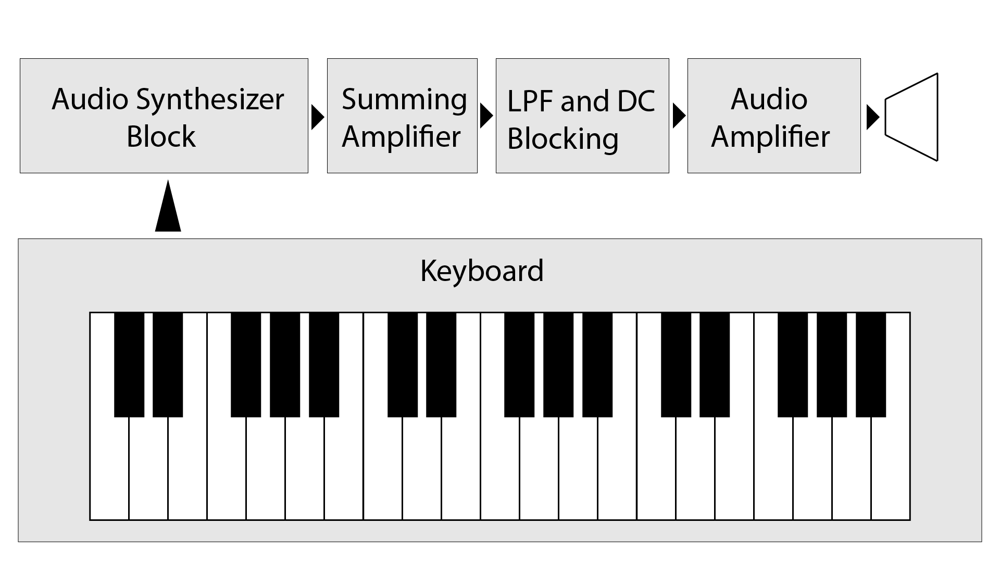
    <figcaption>Keyboard</figcaption>
</figure>

### Tone Generator

The tone generator is basically a set of 36 counter corresponding to the 36 notes of the piano. The system clock has a m*1MHz frequency (m should be 50 if clock is 50MHz). The counters keep incrementing their values in each positive clock edge. After reaching a certain value, the counter resets and toggles an output. 

For example, if the clock frequency is 1MHz, then the counter increases after each 1 micro-second. Say we set the counter to reset at a value of 1000, and toggle an output. After 1000 microseconds have elapsed, the counter reaches the value of 1000, resets to 0 and toggles the output. As a result, the output becomes high after 1 millisecond. After another 1 millisecond, the output toggles once more as the counter resets one more time. Thus we have an output that has a period of 2 milliseconds (500 Hz). In this way, a 500 Hz clock is generated. In this method, different reset values are used for different counters to generate tones of different frequencies.

<figure align="center">
    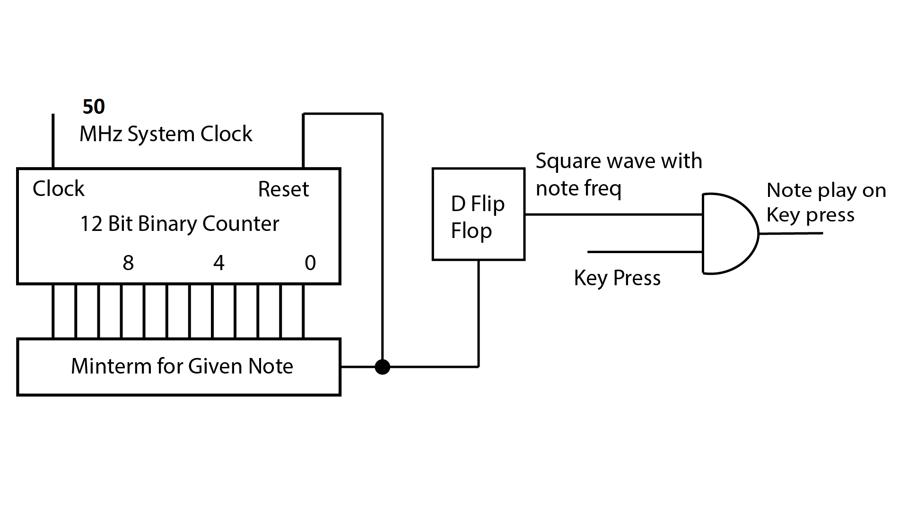
    <figcaption>Demo circuit for single tone</figcaption>
</figure>

A chart containing values of all the frequencies of notes used has been mentioned here. Note that in case the system clock is **m times 1MHz**, the reset value should be set to **m * reset_value**

| Note | Freq(Hz) | Clock cycle | Reset value | Note | Freq(Hz) | Clock cycle | Reset value | Note | Freq(Hz) | Clock cycle | Reset value |
| --- | --- | --- | --- | --- | --- | --- | --- | --- | --- | --- | --- |
|C3	    |130.81|7644|3822|C4	|261.63|3822|1911|C5	|523.25|1911|956|
|C3#    |138.59|7215|3608|C4#	|277.18|3608|1804|C5#	|554.37|1804|902|
|D3	    |146.83|6811|3405|D4	|293.66|3405|1703|D5	|587.33|1703|851|
|D3#    |155.56|6428|3214|D4#	|311.13|3214|1607|D5#	|622.25|1607|804|
|E3	    |164.81|6068|3034|E4	|329.63|3034|1517|E5	|659.25|1517|758|
|F3	    |174.61|5727|2863|F4	|349.23|2863|1432|F5	|698.46|1432|716|
|F3#    |185.00|5405|2703|F4#	|369.99|2703|1351|F5#	|739.99|1351|676|
|G3	    |196.00|5102|2551|G4	|392.00|2551|1276|G5	|783.99|1276|638|
|G3#    |207.65|4816|2408|G4#	|415.30|2408|1204|G5#	|830.61|1204|602|
|A3	    |220.00|4545|2273|A4	|440.00|2273|1136|A5	|880.00|1136|568|
|A3#    |233.08|4290|2145|A4#	|466.16|2145|1073|A5#	|932.33|1073|536|
|B3	    |246.94|4050|2025|B4	|493.88|2025|1012|B5	|987.77|1012|506|


```
// sample code for a single tone

module piano(switch, clk, speaker);

    input switch;           // mapped to input pin
    input clk;              // mapped to system clock
    output speaker;         // mapped to output pin 
    reg flipper;            // flip-flop used to generate tone

    parameter m=50;         // base clock (in MHz) of system
    parameter n=20;         // parameter for counter bit length
    parameter C3=3822;      // flip-flop reset value for C3 note

    reg [n:0] counterC3;    // count up to reset value

    assign speaker = switch & flipper;

    always @(posedge clk) begin
        // Each if-else block is a note frequency generator
        // Note C3
        if(counterC3==m*C3) begin
            counterC3 <= 0; // Counter reset
            flipper[0] <= ~flipper[0]; // Toggle flip-flop
        end else counterC3 <= counterC3+1; 
        // Counter on until reaching half of tone frequency
    end

endmodule
```

### Output

The output stage was initially planned to include amplifiers and active filters, but a simple RC circuit network gave a very smooth audio output for the given notes, so the circuit was kept simple. Each note had a corresponding output pin that connected to the output capacitance with a 10k resistor, and the capacitor output terminal was connected to a wireless speaker with an auxiliary audio cable. The capacitor works as a low pass filter that reduces the high frequency components of the square wave output. 

<figure align="center">
    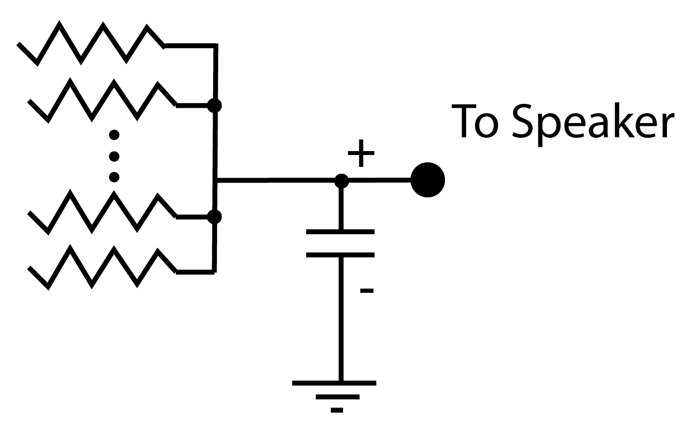
    <figcaption>Output stage</figcaption>
</figure>


## Verilog Simulation

To check whether the keypresses generate the corresponding tones on output, we used the piano.vwf file for sending input to the FPGA and ran the simulation to check outputs. (The simulation might take a lot of time before showing results - approx 25 minutes)

Using a 1MHz clock and setting the parameter m = 1 in the verilog code for the simulation:

<figure align="center">
    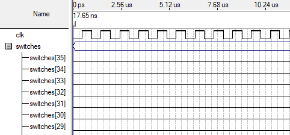
    <figcaption>1 MHz clock signal (high zoom)</figcaption>
</figure>

<figure align="center">
    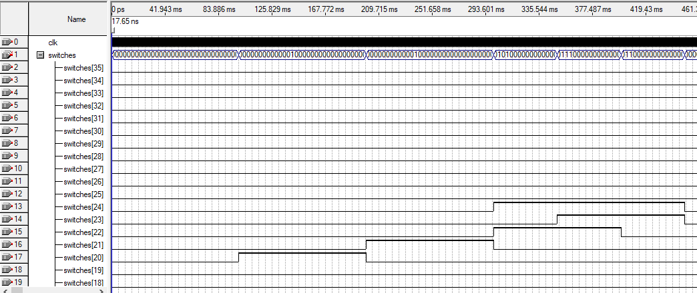
    <figcaption>Random keypresses with around 100-200ms duration</figcaption>
</figure>

<figure align="center">
    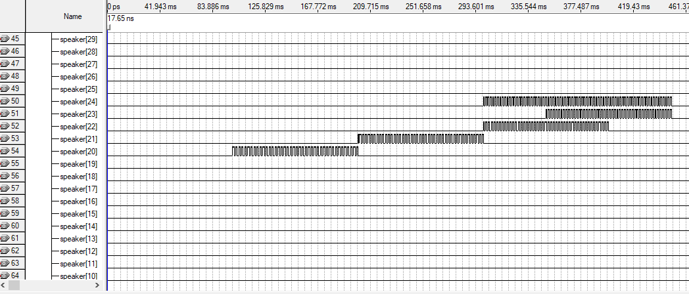
    <figcaption>Oscillating Output corresponding to keypresses</figcaption>
</figure>

<figure align="center">
    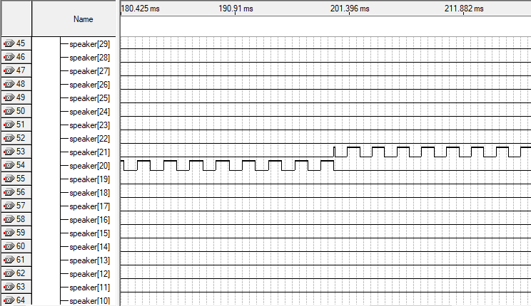
    <figcaption>Output frequency zoomed in</figcaption>
</figure>

## Output Stage Simulation

Proteus was used to check how the square wave inputs are translated to output (square wave changes to triangular wave due to the capacitor. Better filtering may be done but in our case the output sound quality was good enough)

<figure align="center">
    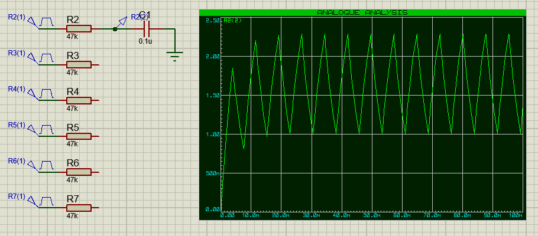
</figure>

<figure align="center">
    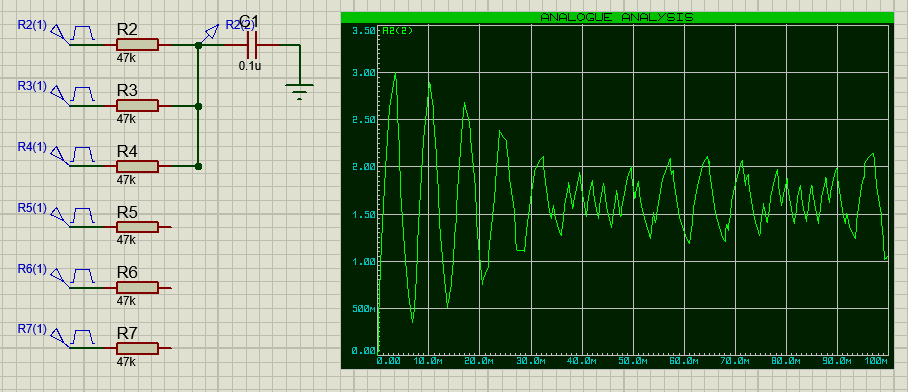
</figure>

<figure align="center">
    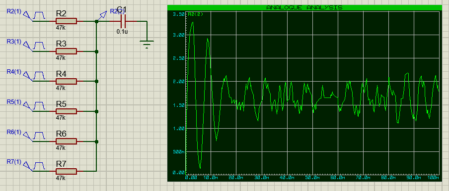
    <figcaption>Output to speaker</figcaption>
</figure>

## Hardware Setup
The hardware was setup following the schematics mentioned above.

<figure align="center">
    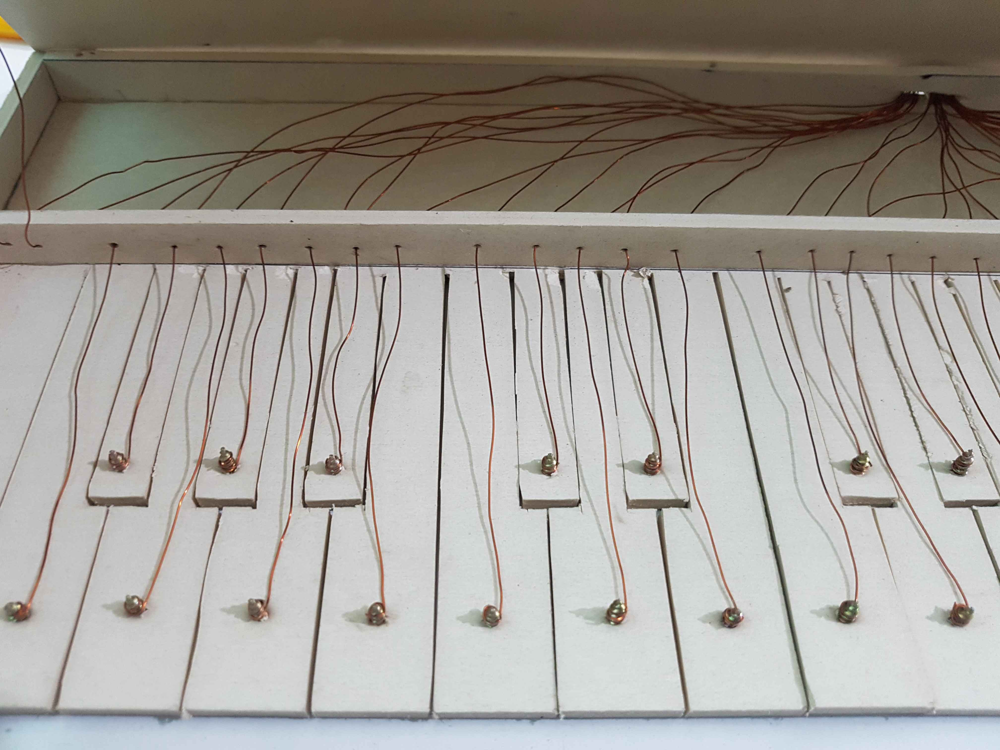
    <figcaption>Each key has a screw through it, and a wire connects each screw to veroboard 1 (veroboard 1 pulls down all the inputs to ground)</figcaption>
</figure>

<figure align="center">
    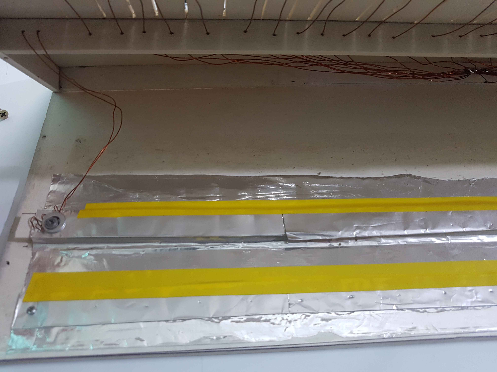
    <figcaption>Bottom part of the piano has an aluminum rail connecting to the +vcc of veroboard 1</figcaption>
</figure>

<figure align="center">
    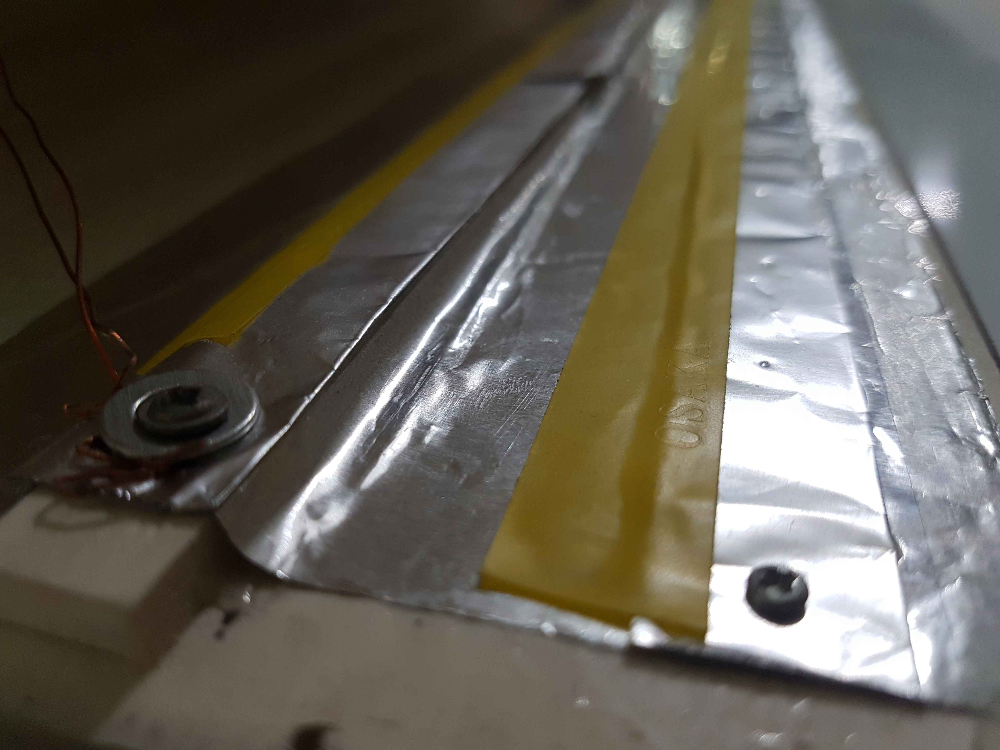
    <figcaption>Aluminum rail close-up</figcaption>
</figure>

<figure align="center">
    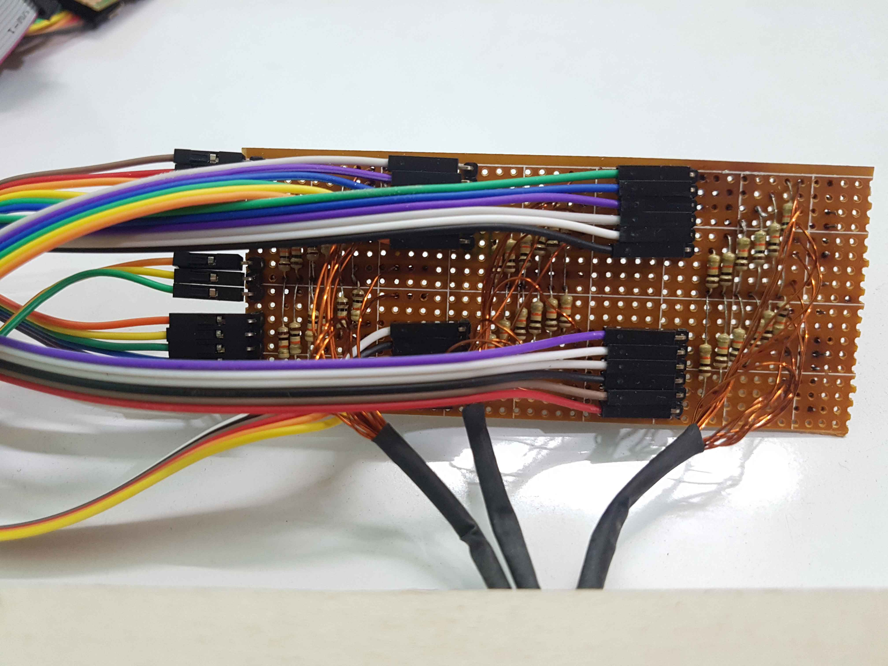
    <figcaption>All screw wires and aluminum rail wire connected to veroboard 1</figcaption>
</figure>

<figure align="center">
    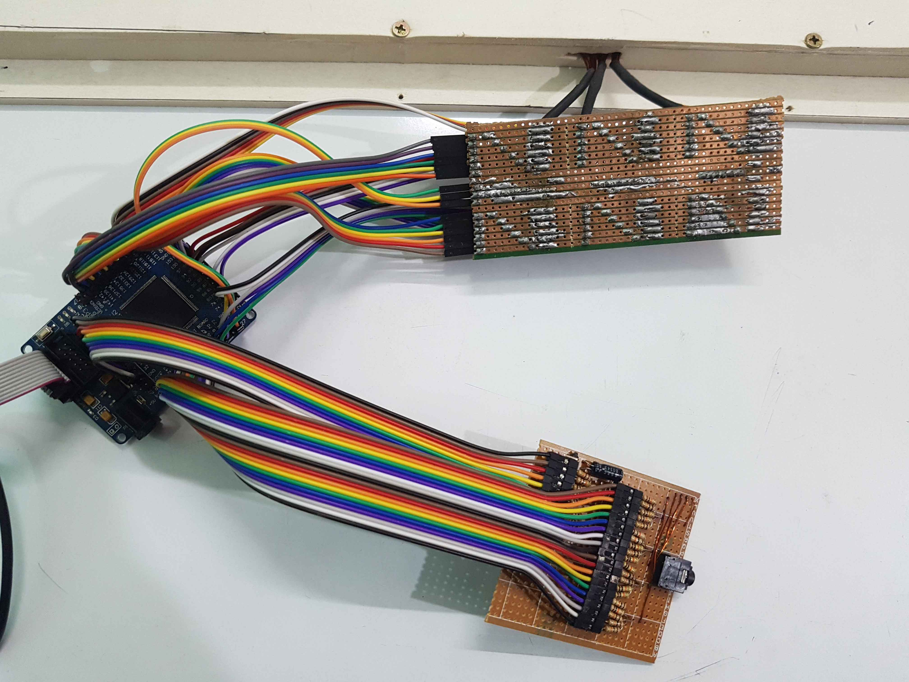
    <figcaption>Fpga (left), veroboard 1 (top) and veroboard 2 (bottom)</figcaption>
</figure>

<figure align="center">
    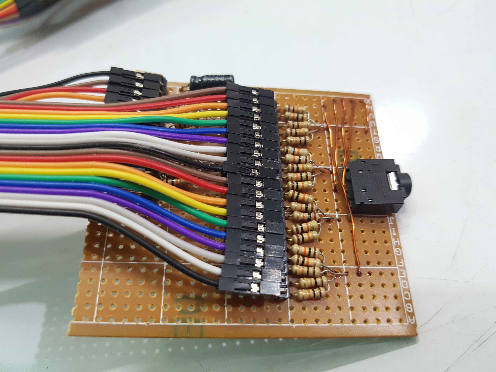
    <figcaption>FPGA output pins connected to the output with a capacitor on veroboard 2 (with a 3.5mm audio jack for convenience)</figcaption>
</figure>

<figure align="center">
    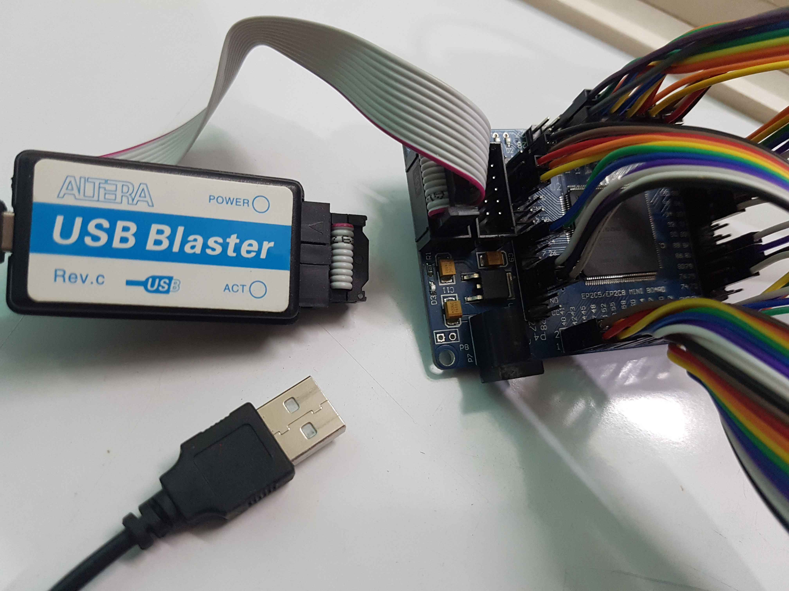
    <figcaption>USB blaster connected to programming port of FPGA board</figcaption>
</figure>

## Final Demo
The demonstration video can be found on Youtube (Final presentation for the laboratory project, the description is in Bengali):
https://youtu.be/95gMFHwd9gE

## Conclusion

Overall the project was a success and the piano could be used to play decent tones with some practice. The sound quality was better than expected and not sharp to the ears. The piano also supported chords (multiple keys pressed at once)

There are a few shortcomings of the project:
- Keypress and sound generation is instantaneous, there is no smooth transition between notes turning on and off - and it might sound weird at times
- Sound quality is not as good as commercial keyboards, and achieving that quality would require more sophisticated circuits (DAC converters, decent keys etc) which was outside the scope of the project.

## Team

- Mir Sayeed Mohammad (EEE) (github - https://github.com/ClockWorkKid)
- Himaddri Roy (EEE) (github - https://github.com/himu587)
- Tusher Raihan (EEE) (github - )

